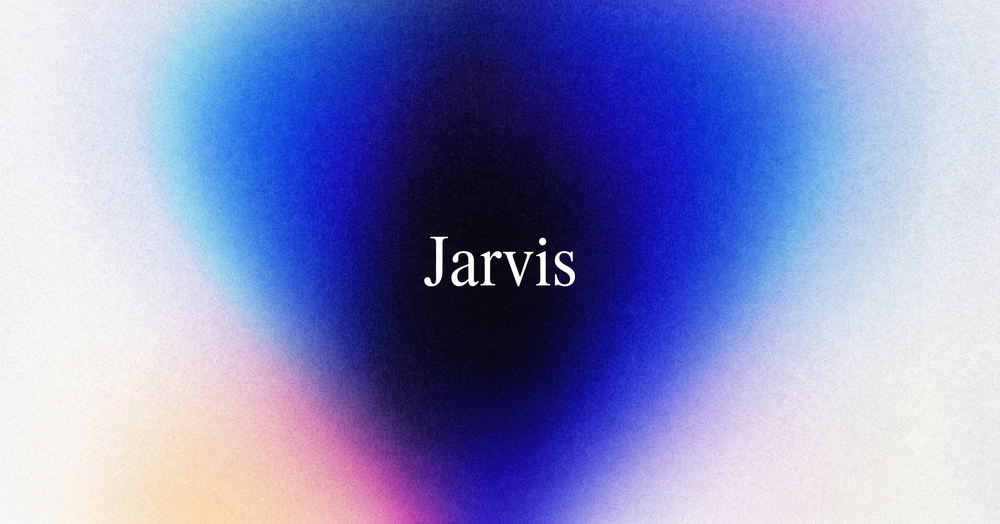
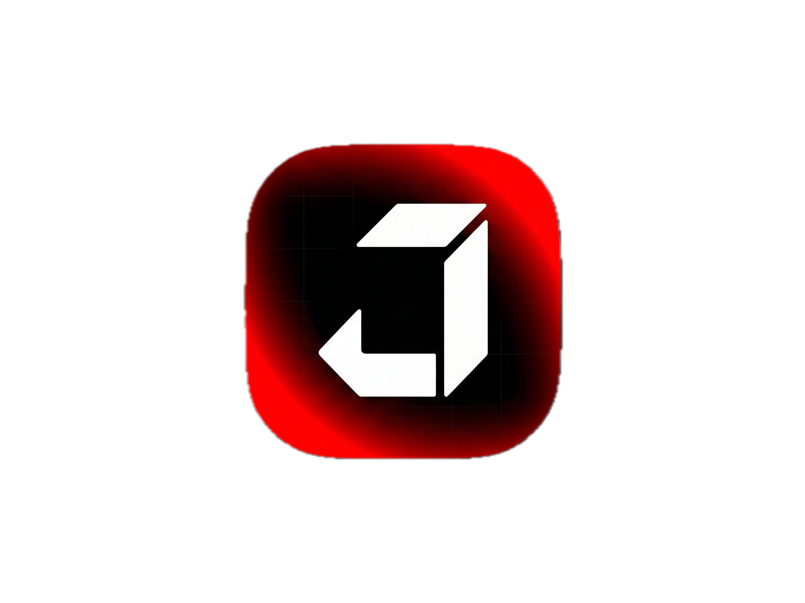

<p align="center">
  
</p>
<table>
  <tr>
    <td width="300" align="center">
      
    </td>
    <td>
  <h1 align="center">J4rvis</h1>
      <p align="center"><strong>Jarvis is an intelligent voice assistant for Android that helps you get things done, from controlling your device and managing everyday tasks to answering questions, remembering what matters, and taking action when you ask.</strong></p>
      <p align="center">
        Your phone, but now with a body.
      </p>
      <p align="center">
        JARVIS combines voice interaction, memory, device control,
        automation, coding agents, local tools and cloud intelligence
        into one assistant built to <strong>think, act, and verify</strong>.
      </p>
    </td>
  </tr>
</table>

[](https://android.com)
[](https://github.com/pranav-pramod-dwivedi/jarvis/releases/tag/v1.0.0-models)
[](https://github.com/pranav-pramod-dwivedi/jarvis/releases/tag/v1.0.0-models)
[](LICENSE)

**JARVIS** is an autonomous, on-device AI personal assistant built for Android that rivals Siri and Google Assistant. It features high-fidelity neural speech synthesis, 100% offline keyword spotting, dynamic floating companion overlays, on-screen context awareness, and a 3-tier hybrid intelligence pipeline (Needle + Local SLM + Autonomous AGY CLI).

**Author & Maintainer**: Pranav Pramod Dwivedi ([@pranav-pramod-dwivedi](https://github.com/pranav-pramod-dwivedi))

---


## 🚀 Key Highlights & Next-Gen Capabilities

- **🔊 Kokoro-82M INT8 Neural Speech Synthesis (ONNX)**:
  - High-fidelity 24kHz float PCM audio streaming with George British voice styling.
  - On-device phoneme lexicon with 88,000+ word mappings and custom Jarvis tokenizations.
  - **Sub-5ms Barge-in Interruption**: Saying *"Stop"* or speaking immediately halts active speech playback.

- **🎙️ openWakeWord "Hey Jarvis" Keyword Spotter (ONNX)**:
  - 3-stage neural pipeline (Mel-spectrogram 32 bins $\to$ 96-dim Google Speech Embedding $\to$ Classifier).
  - Runs continuous 16kHz background inference at $<1\%$ battery with zero continuous cloud recognition loops.

- **✨ Siri-Style & Stark Holographic Floating Companion HUD**:
  - System-wide interactive overlay (`JarvisOverlayService`) accessible over any app (YouTube, Chrome, games).
  - Real-time animated audio waveform visualizer (`StarkWaveformView`), live transcription ticker, and draggable compact bubble mode.

- **📱 Context-Aware On-Screen AI Assistant**:
  - Analyzes the currently active screen (`ScreenContextReader` via Accessibility) to summarize articles, extract codes, and answer questions like *"What's on my screen?"*.

- **📦 On-Demand Zero-Bloat Model Hub**:
  - Keeps APK sizes featherlight ($<15\text{ MB}$).
  - Automatically downloads model suites from [Official GitHub Releases](https://github.com/pranav-pramod-dwivedi/jarvis/releases/tag/v1.0.0-models) with background progress bars and hash validation.

- **⚡ Android Quick Settings Tile**:
  - Instant one-tap access to voice listening and floating HUD directly from the notification shade.

---

## 🧠 3-Tier Intelligence Architecture

```
User Voice / Text / Screen Query
               │
               ▼
┌─────────────────────────────────────────────────────────┐
│              JARVIS Voice Assistant Pipeline            │
│                                                         │
│  [Low-Power Acoustic Monitor]                           │
│           │                                             │
│           ▼                                             │
│  [OnnxWakeWordEngine] ── 16kHz PCM (openWakeWord)       │
│    ├── melspectrogram.onnx (log-mel extraction)         │
│    ├── embedding_model.onnx (Google speech embedding)   │
│    └── hey_jarvis_v0.1.onnx (neural probability)        │
│           │                                             │
│           ▼ "Jarvis" confirmed (Prob ≥ 0.28)           │
│  [SpeechRecognizer Session / Floating HUD Overlay]      │
└─────────────────────────┬───────────────────────────────┘
                          │ Recognized Utterance
                          ▼
┌─────────────────────────────────────────────────────────┐
│              Unified Assistant Dispatcher               │
│                                                         │
│  Tier 1: Deterministic Needle & Intent Router (<15ms)   │
│    ├── Direct regex & LanguageNormalizer (En / Hi)      │
│    └── Canonical tools (Flashlight, WiFi, Calls, Apps)  │
│                                                         │
│  Tier 2: On-Device Local SLM (Qwen 2.5 0.5B/1.5B GGUF)  │
│    ├── Completely offline reasoning & tool translation  │
│    └── Maps ambiguous natural queries to Needle tools   │
│                                                         │
│  Tier 3: Autonomous Ubuntu AGY CLI & Cloud Intelligence │
│    ├── Zero-API-key AGY CLI inside Ubuntu PRoot / Termux│
│    └── Gemini Cloud generative reasoning fallback       │
└─────────────────────────┬───────────────────────────────┘
                          │ Speech Response Output
                          ▼
┌─────────────────────────────────────────────────────────┐
│         Kokoro-82M INT8 ONNX Neural TTS Engine          │
│   (24kHz PCM Float Streaming + Instant Barge-in Stop)   │
└─────────────────────────────────────────────────────────┘
```

---

## 📦 Neural Engine Models & Downloads

AI model weights are hosted on GitHub Releases and downloaded on-demand:

| Model Suite | Size (Compressed) | Uncompressed | Download URL |
| :--- | :--- | :--- | :--- |
| **openWakeWord Hey Jarvis ONNX** | 2.9 MB | ~3.5 MB | [openwakeword-models.zip](https://github.com/pranav-pramod-dwivedi/jarvis/releases/download/v1.0.0-models/openwakeword-models.zip) |
| **Kokoro-82M INT8 Neural TTS** | 61 MB | ~98 MB | [kokoro-tts-v1.0.zip](https://github.com/pranav-pramod-dwivedi/jarvis/releases/download/v1.0.0-models/kokoro-tts-v1.0.zip) |

---

## 🛠️ Project Structure

```
app/src/main/
├── java/com/pr4nav/jarvis/
│   ├── MainActivity.kt               # Futuristic Arc-Reactor orb UI
│   ├── AgentActivity.kt              # Interactive Chat stream with execution cards
│   ├── JarvisAccessibilityService.kt # Screen reader & UI automation
│   ├── companion/
│   │   ├── JarvisOverlayService.kt   # System-wide floating HUD overlay
│   │   └── CompanionManager.kt       # Proactive assistant signals
│   ├── gui/
│   │   └── StarkWaveformView.kt      # Glowing multi-phase sine wave visualizer
│   ├── capabilities/
│   │   ├── ScreenContextReader.kt    # On-screen text analyzer
│   │   └── CanonicalToolRegistry.kt  # Android system & hardware tools
│   ├── voice/
│   │   ├── KokoroTtsEngine.kt        # Kokoro-82M neural TTS synthesizer
│   │   ├── OnnxWakeWordEngine.kt     # openWakeWord 3-stage KWS engine
│   │   ├── ModelDownloadManager.kt   # GitHub Release model downloader & extractor
│   │   ├── ModelHubActivity.kt       # Model management UI & download center
│   │   ├── JarvisVoiceService.kt     # Hands-free background service
│   │   ├── JarvisTileService.kt      # Android Quick Settings tile
│   │   └── VoiceAssistantPreferences.kt
│   └── router/
│       ├── UnifiedAssistantDispatcher.kt
│       └── NeedleEngine.kt
└── res/
    ├── layout/
    │   ├── activity_main.xml
    │   ├── activity_agent.xml
    │   ├── activity_model_hub.xml
    │   └── layout_jarvis_floating_hud.xml
    └── drawable/
```

---

## 🔧 Building & Installation

1. **Clone the repository**:
   ```bash
   git clone https://github.com/pranav-pramod-dwivedi/jarvis.git
   cd jarvis
   ```

2. **Build and Install Debug APK**:
   ```bash
   ./gradlew assembleDebug
   adb install -r app/build/outputs/apk/debug/app-debug.apk
   ```


## 📄 License

Copyright (c) 2026 Pranav Pramod Dwivedi. All rights reserved.  
Distributed under the Apache 2.0 License.
